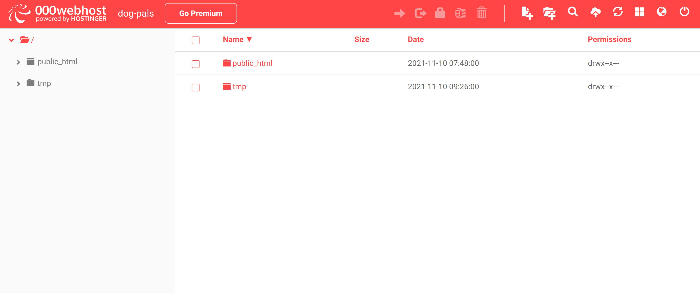

# :wave: is216-project

  

## 🤓 IS216 - Group 28 - DogPals &#128021;
The team comprises of 5 web developers:

* DARIEN TAN SHI FENG (darien.tan.2020@scis.smu.edu.sg)
  🐶 Darien has always wanted a dog and is considering to get one when he lives alone. 
* HAZEL MA RUIQI (hazelma.2020@scis.smu.edu.sg) 
  🐶 Hazel had a maltese called Snowball. She enjoyed playing with him and bringing him out to explore!
* JOEY LAU RUN-QI (joeylau.2020@scis.smu.edu.sg)
  🐶 Joey visits pet cafes in her free time. Albeit afraid of large dogs, she finds small furry dogs really adorable and easy to befriend!
* SHAMBHAVI GOENKA (shambhavig.2019@scis.smu.edu.sg)
  🐶 Shambhavi feeds the street dogs every now and then and always carries some food while travelling so as to feed other street dogs spotted.
* TAN TING CHER BENJAMIN (benjamintan.2020@scis.smu.edu.sg)
  🐶 Benjamin had 2 dogs, phoebe and fatty whilst living in Thailand.

As seen above, all 5 of us have experience interacting with dogs and a soft spot to care for their needs, and this led us to the birth of DogPals! 🐕

## 🤓 Project Overview ##
We started this web application called DogPals with the aim of providing a platform for dog owners to find playmates for their pet. Other functionalities include allowing users to chat with other dog owners and arranging for a playdate between them and their dogs as well as showcasing pet-friendly places with high ratings and good reviews to recommend dog owners to visit with their dog. 🥰

We noticed that there is a rising trend of dog adoption and fostering in Singapore amid the COVID-19 pandemic but it has also come to our attention that dog loneliness can stem from being left alone at home when their owners head out to work. Just like all of us, dogs have emotions and do crave for companionship. As a group of dog-loving individuals, we decided to use DogPals to help these dogs verbalise their needs for socialisation and address this pain point. 🤍

Dogpals is targeting dog owners of all ages and gender in Singapore who are looking to find playmates for their dogs or exploring pet-friendly places to bring their dogs to. These owners can either view our website on a Macbook Pro, 13.3 inch with screen dimensions (1440 x 900) or on iphone X, 5.85 inch with screen demensions (375 x 812) for optimal results. 💻 📱

## 🤓 How to Install and Run Our Web Application (for Developers) ##

The new developer should have WAMP and Github desktop downloaded in his laptop.

### WampServer installation

**Step 1.** Download WampServer

It requires the latest version of [WAMP](https://sourceforge.net/projects/wampserver/files/latest/download)

**Step 2.** Next right-click the application and run as administrator

**Step 3.** Click Yes

**Step 4.** Choose English

**Step 5.** Accept license agreement by clicking next

**Step 6.** Ensure all steps of the installation are done prior to installation of WampServer

**Step 7.** Install it on C:\ or D:\ drive

**Step 8.** Choose the latest version of MYSQL which is MYSQL8.0.21

**Step 9.** Accept the default by clicking next

**Step 10.** Click install if the information shown on the confirmation screen is correct

**Step 11.** For this Web Application we are using Chrome. Click yes to select another Browser.

**Step 12.** Go to this directory C:\Program Files (x86)\Google\Chrome\Application and select Chrome.exe and click open

**Step 13.** Select no when prompted for your default text editor

**Step 14.** Select next when you see this screen

**Step 15.** Click finish as set up has been completed

**Step 16.** Select [Allow access] if you see a Security alert

## 🤓 [OPTIONAL] How to Deploy Our Web Application (for Developers) ##

Our group deployed our web application to 000webhost. Click [here]( https://dog-pals.000webhostapp.com/) to view our website.

### Steps on how to deploy our web application

**Step 1.** Go to 000webhost website and sign up for an account

**Step 2.** Enter your website name and website password. 

**Step 3.** Select the 3rd option "Upload your site"

**Step 4.** Click on public_html and upload your files from your directory

**Step 5.** To upload your database, select "Manage Website" from your website list.

**Step 6.** At the left panel, select Tools > Database Manager

**Step 7.** Select "New Database" to create a database. Click on Manage > PhpMyAdmin

**Step 8.** Import your MySQL Database into the database you have created

**Step 9.** Select your Connection Manager file you have previously imported. Change username, password and dbname to the names created in Step 8

**Your website is ready! :tada:**

## 🤓 How to Use Our Web Application (for Visitors to our Website) ##

**Upon visiting our website, the user will be brought to the homepage. If the user is a new visitor, he can sign up for an account with us by clicking on the 'SIGN UP' button. If the user already has an account, he can simply click on the 'LOGIN' button.**

 

**At the sign up page, the user is required to fill in their email, create a username and password! In order to proceed, the user has to check on the reCAPTCHA checkbox.**

 

**On the other hand, the login page requires the user to enter their username and password to verify their credentials.**

 

**After the account registration, it will then bring the user to the profile set up which requires him to perform a series of steps to fill in information about both him and his dog.**

**Step 1: User's personal information**

 

**Step 2: User's dog information**

 

**Step 3: More information about the user's dog so that other dog owners will know if the dog is a right match for them**

 

**Step 4: View summary of both profiles and if there are no changes to be made, the user can proceed to click 'SUBMIT'.**

 

*We are making an assumption here that most dog owners only have ONE dog. Therefore, we only allow users to fill in ONE dog profile.*

**The user is now login to her account and can see a 'Chat' tab added to her navigation bar. The 'Chat' tab is not visible to users who did not register an account with DogPals.**

 

**The user can click on the 'Find a Playmate' tab to view profiles of other dogs. She can make use of the search and filter bar to help narrow down the search of a particular dog. If any playmate catches the user's eye, the user can click on 'READ MORE' to view a more comprehensive profile of the playmate. Users who do not have an account can access this page as well.**

 

**After viewing the profile, the user can click on 'Contact Owner' to start chatting with the playdate's owner if she decides that the playmate is a right match for her dog.**

 

**Upon clicking, the user will be brought to her chat page which allows her to initiate a conversation. If the conversation flows well, both owners can arrange for a playdate.**

 

**Next, both owners just need to wait for the date to arrive, bring their dogs out and have some fun! 🥳**

**However, if the user is not login to her account, there will be a pop up prompting the user to sign up or login in order to chat with other dog owners.**

 

**At the 'Find a Place' page, there is a variety of categories recommended for the user to bring her dog to or to replenish dog supplies. There is also a map to help users to make informed decision of the distance required to reach the destination. Users who do not have an account can access this page as well.**

**Calculate Distance between the user's current location and planned destination**

 

 

**If the user scrolls down, she will be able to view the different categories. Upon clicking on 'SEE MORE', she will be directed to another page that displays all the recommended places by DogPals.**

 

**Over here, the user can make use of the search and filter bar to look for a desired place to bring her dog to.**

 

**That's all! We hope you have a fuss free and enjoyable experience at DogPals! 🐶**

## 🧐 X-Factors
**1. Firebase**
  - Cloud-hosted NoSQL database that allows users to store and sync data in realtime.
  - Used for building chat webpage.
 
**2. Cloud - 000webhost**
  - Deployed our Web Application to 000webhost to allow our friends, classmates and professors to visit our Web Application.

**3. Anime.js**
  - Animate different CSS properties, SVG or DOM attributes on webpage.
  - Enhances user experience, bring user interface to life and to communicate with the user.

**4. Git**
  - DevOps tool used for source code management. It tracks changes made to files, allowing multiple developers to work together.
  - By committing and pushing our codes to Git, we are able to view source code history and revert code versions when needed.

## 🤓 FIGMA
The team used Figma as our prototyping tool for our web application. You may view our Figma Prototype via the following links:

- [Macbook Pro](https://www.figma.com/proto/3LJZ1JQzYDJ17gy555ez56/WAD?node-id=396%3A3903&scaling=scale-down&page-id=0%3A1&starting-point-node-id=396%3A3903&show-proto-sidebar=1)
- [iPhone X](https://www.figma.com/proto/3LJZ1JQzYDJ17gy555ez56/WAD?node-id=396%3A3913&scaling=scale-down&page-id=0%3A1&starting-point-node-id=396%3A3913&show-proto-sidebar=1)

## 🤓 Architecture Diagram

 

## 🤓 References

The team would like to acknowledge and credit the following sources:

* Homepage Typewriter Effect: **Matt Boldt Typed.js Library** [Github](https://github.com/mattboldt/typed.js)
* Slider Login/Sign up Page: **True Coder** [Github](https://github.com/sefyudem/javascript-sliding-login-and-registration-form) [Youtube](https://www.youtube.com/watch?v=fC3qLUWf_Lk)
* Check if username exists real-time: **Cloud Rebue Solutions** [Website](https://cloudrebue.co.ke/how-to-live-check-user-exists-jquery-ajax-php/)
* Login/Sign up Form validatoin: **Javascript Tutorial** [Website](https://www.javascripttutorial.net/javascript-dom/javascript-form-validation/)
* Multi-step Profile Set up: **CodingNepal** [Website](https://www.codingnepalweb.com/multi-step-form-html-css-javascript/) [Youtube](https://www.youtube.com/watch?v=FKIafz8qgpk)
* Find a Place Page: Javascript Google Map Directions API & Places API Project🔥 - \[2021] | Google Map Javascript Tutorial **Sam Codes** [YouTube](https://www.youtube.com/watch?v=BkGtNBrOhKU&t=619s&ab_channel=SamCodes)
    * Adapted how to find distances between cities to instead buildings/places in Singapore
* Find a Place Page: Google Maps API Tutorial | Custom Marker Icon | Multiple Info Window **Pradip Debnath** [YouTube](https://www.youtube.com/watch?v=Xptz0GQ2DO4&t=621s&ab_channel=PradipDebnath)
    * Adapted how to forloop the markers and how to customise markers icons
* Individual Dog Page: Javascript & CSS Heart Animations [Website](https://medium.com/front-end-weekly/how-to-fill-your-website-with-lovely-valentines-hearts-d30fe66d58eb)
* Chat Template: **Chat Widget** [Website](https://codepen.io/drehimself/pen/KdXwxR)
* Building a firebase chat app: **Let’s Build a Firebase Chat App using Vanilla JavaScript** [Website](https://levelup.gitconnected.com/lets-build-a-firebase-chat-app-using-vanilla-javascript-4baf877d9f49)
* Understanding basic concept for read/unread messages: **React Chat App Part 8 - Unread Messages** [YouTube](https://www.youtube.com/watch?v=k_szzEIYA80)
* Getting concept of deletion of message: **REALTIME WEB-BASED CHAT IN FIREBASE** [Website](https://adnan-tech.com/realtime-web-based-chat-in-firebase/)
* Understanding more in depth about firebase: **Read and Write Data on the Web** [Website](https://firebase.google.com/docs/database/web/read-and-write)
* Bell ringing: **Ringing Bell Animation** [Website](https://codepen.io/Mrshcom/pen/bqmFg)

## 🤓 Useful Resources ##
* [**Markdown** Cheat Sheet](https://www.markdownguide.org/cheat-sheet/)
* [**GOOD** README Example 1](https://github.com/testing-library/cypress-testing-library)
* [**GOOD** README Example 2](https://github.com/typeorm/typeorm)
* [**GOOD** README Example 3](https://github.com/amark/gun)
* [**GOOD** README Example 4](https://github.com/google/leveldb)
